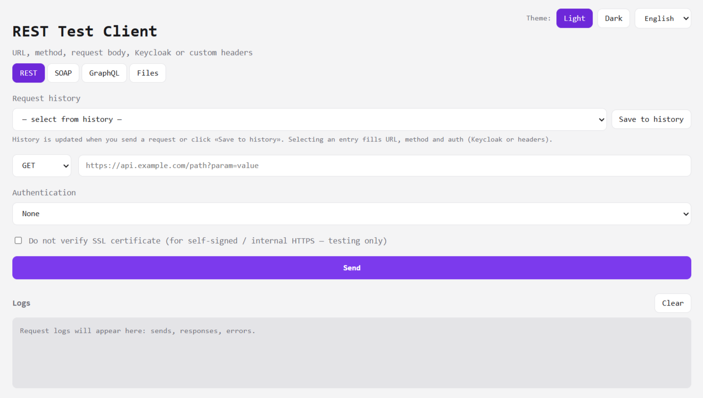

# REST Test Client

[English version](README_EN.md)

[](https://bun.sh/)
[](https://react.dev/)
[](https://vitejs.dev/)
[](https://www.typescriptlang.org/)
[](https://www.docker.com/)



Универсальный веб-клиент для тестирования API: REST, SOAP, GraphQL и работа с файлами (S3-совместимое API). Единая история запросов, аутентификация через Keycloak или ручные заголовки, отображение ответов (JSON, таблица, XML), опциональное шифрование чувствительных данных в истории.

- **Стек:** Bun (сервер + API), React + Vite (фронтенд)
- **Порт по умолчанию:** 5335 (настраивается через `PORT`)
- **История:** последние 20 запросов (настраивается через `HISTORY_SIZE`), общая для REST/SOAP/GraphQL

## Требования

- Для локальной разработки и сборки: [Bun](https://bun.sh/) или Node.js 18+

## Установка

```bash
bun install
cd frontend && bun install && cd ..
```

## Конфигурация

Скопируйте `.env.example` в `.env` и при необходимости измените:

- `PORT` — порт веб-интерфейса (по умолчанию 5335)
- `HISTORY_SIZE` — сколько последних запросов хранить в истории (по умолчанию 20)
- `HISTORY_ENCRYPTION_KEY` — (опционально) ключ для шифрования паролей и токенов в истории (32 байта base64 или 64 символа hex)

## Запуск

1. Собрать фронтенд (один раз или при изменениях):

```bash
bun run build
```

2. Запустить сервер:

```bash
bun start
```

Откройте в браузере: **http://localhost:5335**

## Запуск в Docker (рекомендуется для продакшена)

Собирайте и запускайте приложение **только через Docker**: сборка фронтенда выполняется внутри образа на Node 20, на хосте не нужны ни новая Node, ни Bun.

### Сборка образа

```bash
docker build -t rest-test-client .
```

### Запуск контейнера

Стандартный порт (5335):

```bash
docker run --rm -p 5335:5335 rest-test-client
```

Кастомный порт и параметры истории:

```bash
docker run --rm \
  -e PORT=8080 \
  -e HISTORY_SIZE=50 \
  -p 8080:8080 \
  rest-test-client
```

После запуска откройте: `http://localhost:5335` или другой порт, который вы пробросили.

На проде с Node 10 достаточно установленного **Docker**: при `docker build` фронтенд собирается внутри контейнера на Node 20, рантайм — Bun в своём образе. Версия Node на хосте не используется.

### Режим разработки

- Сервер с автоперезагрузкой: `bun run dev`
- Фронтенд с hot-reload (прокси на API 5335): `bun run frontend:dev` — интерфейс будет на http://localhost:5336

## Пайплайн запроса (от клиента до целевого API и обратно)

1. **Браузер (React)** — пользователь нажимает «Отправить». Формируется тело: `{ url, method, headers?, body?, keycloak? }`. Отправляется **POST /api/execute** на наш сервер (порт 5335).

2. **Bun-сервер (server.ts)** — принимает запрос на `/api/execute`, парсит JSON. Если передан **keycloak** — запрашивает токен у Keycloak (`getKeycloakToken`), подставляет **Authorization: Bearer &lt;token&gt;** в заголовки. Иначе используются только переданные вручную заголовки.

3. **Прокси-запрос к целевому API** — сервер выполняет **fetch(url, { method, headers, body })** к указанному пользователем URL (внешний API). Исходный запрос идёт с нашего сервера, поэтому обходится CORS и можно слать запросы к любым доменам.

4. **Ответ целевого API** — сервер читает `status`, `statusText`, заголовки и тело ответа. Для бинарных ответов (например `application/octet-stream`) тело возвращается в виде `bodyBase64`. Запрос добавляется в **историю**, клиенту возвращается JSON: `{ status, statusText, headers, body?, bodyBase64?, contentType }`.

5. **Браузер** — получает ответ от `/api/execute`, пишет запись в **логи**, показывает результат (JSON/таблица/XML) или инициирует скачивание файла при наличии `bodyBase64`.

Итого: **браузер → наш API (5335) → [опционально Keycloak за токеном] → целевой URL → ответ целевого API → наш API → браузер**.

## Возможности

- **REST** — URL, метод GET/POST/PUT/DELETE, тело запроса (JSON), история по URL и методу
- **SOAP** — URL, SOAPAction, XML-тело; ответ отображается в виде отформатированного XML
- **GraphQL** — URL endpoint, Query, Variables, Operation name; кнопка «Загрузить схему» (introspection)
- **Файлы (S3-совместимое API):**
  - **Скачивание** — GET по URL, сохранение файла (имя из `Content-Disposition` или из пути)
  - **Простая загрузка** — один PUT с телом файла (presigned URL и т.п.)
  - **Multipart S3** — инициализация (`POST ?uploads`), загрузка частей (размер 5–100 MB), завершение (`CompleteMultipartUpload`)
- **Аутентификация** (общая для всех вкладок):
  - **Keycloak** — сервер, realm, client id/secret, логин/пароль; токен подставляется в `Authorization`
  - **Ручные заголовки** — произвольные пары «имя — значение»
- **История** — общий список последних запросов (REST/SOAP/GraphQL), фильтрация по типу вкладки, подстановка URL и параметров при выборе
- **Ответ** — вкладки «JSON» (форматированный), «Таблица» (по JSON), для SOAP/схемы — XML; для файлов — скачивание по `bodyBase64`
- **Тема** — светлая/тёмная (сохраняется в localStorage)
- **HTTPS** — опция «Не проверять сертификат SSL» для тестовых окружений с самоподписанными сертификатами

История сохраняется в `data/history.json`. Опционально: задайте в `.env` переменную `HISTORY_ENCRYPTION_KEY` (32 байта base64 или 64 символа hex, например `openssl rand -base64 32`) — тогда пароли, client secret Keycloak и заголовок Authorization в истории шифруются (AES-256-GCM).
